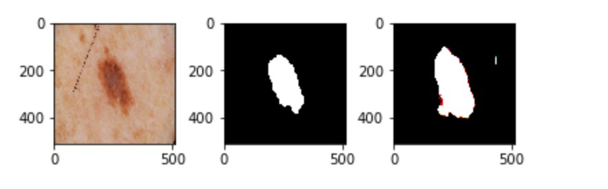
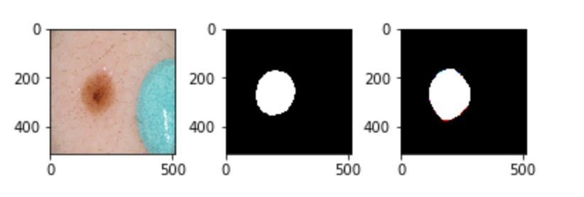

# ISIC-2017-U-Net-Tensorflow-2.0
U-Net Model (using Tensorflow 2.0) to segment skin lesion images - ISIC 2017 data

Dataset available here -https://challenge.kitware.com/#challenge/583f126bcad3a51cc66c8d9a

Results- 

